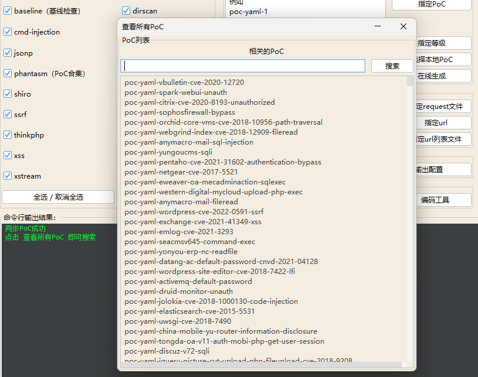
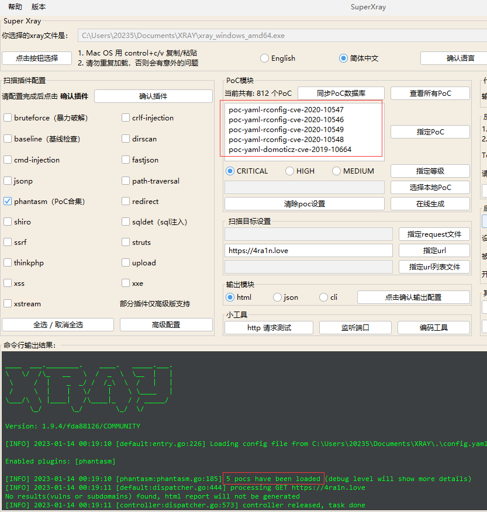
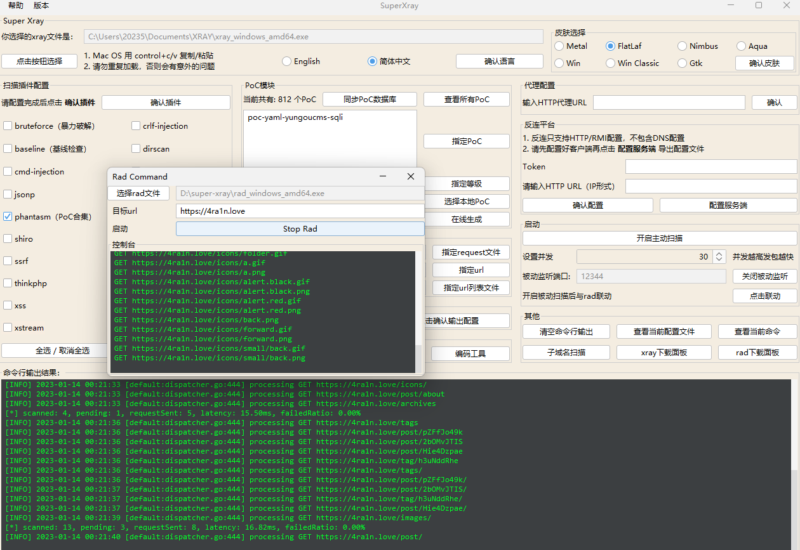
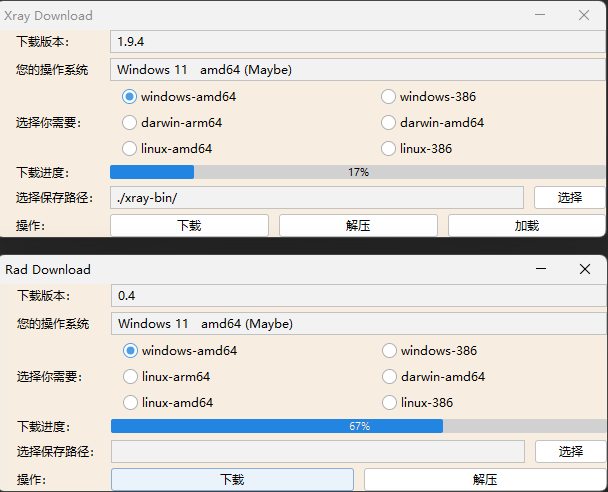
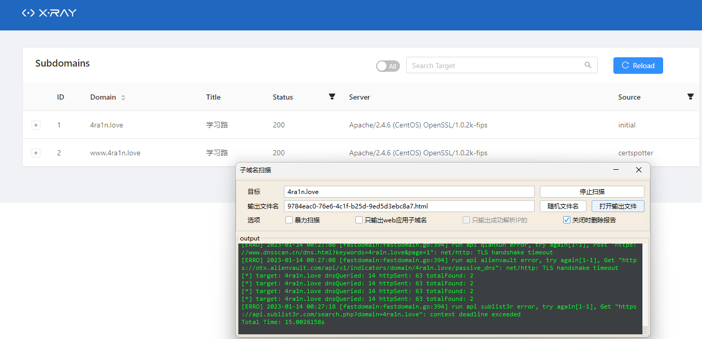
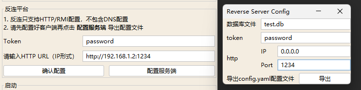
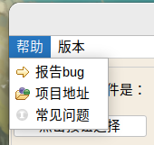
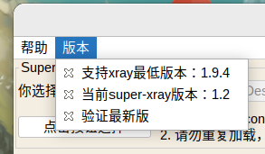

<h1 align="center">Welcome to xray 👋</h1>
<p>
  
  
  
  <a href="https://chaitin.github.io/xray/#/">
    
  </a>
</p>

> 一款功能强大的安全评估工具 

### ✨ Demo


[**English Version**](./README_EN.md)

🏠[使用文档](https://docs.xray.cool)  ⬇️[下载地址](https://github.com/chaitin/xray/releases) 

注意：xray 不开源，直接下载构建的二进制文件即可，仓库内主要为社区贡献的 poc，每次 xray 发布将自动打包。

## 🚀 快速使用

**在使用之前，请务必阅读并同意 [License](https://github.com/chaitin/xray/blob/master/LICENSE.md) 文件中的条款，否则请勿安装使用本工具。**

1. 使用基础爬虫爬取并对爬虫爬取的链接进行漏洞扫描
    
    ```bash
    xray webscan --basic-crawler http://example.com --html-output vuln.html
    ```

1. 使用 HTTP 代理进行被动扫描
    
    ```bash
    xray webscan --listen 127.0.0.1:7777 --html-output proxy.html
    ```
   设置浏览器 http 代理为 `http://127.0.0.1:7777`，就可以自动分析代理流量并扫描。
   
   >如需扫描 https 流量，请阅读下方文档 `抓取 https 流量` 部分

1. 只扫描单个 url，不使用爬虫
    
    ```bash
    xray webscan --url http://example.com/?a=b --html-output single-url.html
    ```

1. 手动指定本次运行的插件
   
   默认情况下，将会启用所有内置插件，可以使用下列命令指定本次扫描启用的插件。
   
   ```bash
   xray webscan --plugins cmd-injection,sqldet --url http://example.com
   xray webscan --plugins cmd-injection,sqldet --listen 127.0.0.1:7777
   ```
      
1. 指定插件输出

    可以指定将本次扫描的漏洞信息输出到某个文件中:
    
    ```bash
    xray webscan --url http://example.com/?a=b \
    --text-output result.txt --json-output result.json --html-output report.html
    ```
    
    [报告样例](https://docs.xray.cool/assets/report_example.html)

其他用法请阅读文档： https://docs.xray.cool


## 🛠 检测模块

新的检测模块将不断添加

 - XSS漏洞检测 (key: xss)

   利用语义分析的方式检测XSS漏洞

 - SQL 注入检测 (key: sqldet)

   支持报错注入、布尔注入和时间盲注等

 - 命令/代码注入检测 (key: cmd-injection)

   支持 shell 命令注入、PHP 代码执行、模板注入等

 - 目录枚举 (key: dirscan)

   检测备份文件、临时文件、debug 页面、配置文件等10余类敏感路径和文件

 - 路径穿越检测 (key: path-traversal)

   支持常见平台和编码

 - XML 实体注入检测 (key: xxe)

   支持有回显和反连平台检测

 - poc 管理 (key: phantasm)

   默认内置部分常用的 poc，用户可以根据需要自行构建 poc 并运行。文档：https://docs.xray.cool/#/guide/poc

 - 文件上传检测 (key: upload)

   支持常见的后端语言

 - 弱口令检测 (key: brute-force)

   社区版支持检测 HTTP 基础认证和简易表单弱口令，内置常见用户名和密码字典

 - jsonp 检测 (key: jsonp)

   检测包含敏感信息可以被跨域读取的 jsonp 接口

 - ssrf 检测 (key: ssrf)

   ssrf 检测模块，支持常见的绕过技术和反连平台检测

 - 基线检查 (key: baseline)

   检测低 SSL 版本、缺失的或错误添加的 http 头等

 - 任意跳转检测 (key: redirect)

   支持 HTML meta 跳转、30x 跳转等

 - CRLF 注入 (key: crlf-injection)

   检测 HTTP 头注入，支持 query、body 等位置的参数
 
 - Struts2 系列漏洞检测 (高级版，key: struts)

   检测目标网站是否存在Struts2系列漏洞，包括s2-016、s2-032、s2-045等常见漏洞

 - Thinkphp系列漏洞检测 (高级版，key: thinkphp)

   检测ThinkPHP开发的网站的相关漏洞
 
 - ..


## ⚡️ 进阶使用

下列高级用法请查看 https://docs.xray.cool/ 使用。

 - 修改配置文件
 - 抓取 https 流量
 - 修改 http 发包配置
 - 反连平台的使用
 - ...

## ⚡️ GUI 工具

### 下载

最新版下载地址：[Latest Release](https://github.com/4ra1n/super-xray/releases/latest)

### PoC搜索



### 指定多个PoC

搜索后复制到输入框，注意换行分割



### 与rad联动

注意：先输入端口开启被动扫描，再打开`rad`配合



### 下载面板

一键下载最新版`xray`和`rad`工具：



### 子域名扫描

支持子域名扫描，但是高级版才可以使用



### 反连平台

1. 配置好客户端的反连平台后点击`配置服务端`
2. 任意输入数据库文件名
3. 任意输入token密码
4. 不要改ip并输入一个监听端口
5. 点击导出配置文件得到一个`reverse/config.yaml`
6. 把`xray`和这个文件复制一份到服务端
7. 服务端`./xray reverse`启动反连平台
8. 在反连平台输入对应到`token`和`http url`即可（注意是ip格式例如http://1.1.1.1:8080）
9. 开启主动扫描或被动扫描即可



### 菜单

帮助与支持



版本检测: 由于使用`Github API`查询版本，所有可能有一些延迟




## 😘 贡献 POC

参照: https://docs.xray.cool/#/guide/contribute

## 📝 讨论区

提交误报漏报需求等等请务必先阅读 https://docs.xray.cool/#/guide/feedback

如有问题可以在 GitHub 提 issue, 也可在下方的讨论组里

1. GitHub issue: https://github.com/chaitin/xray/issues
2. QQ 群: 717365081
3. 微信公众号：微信扫描以下二维码，关注我们


4. 微信群: 微信扫描以下二维码加群


