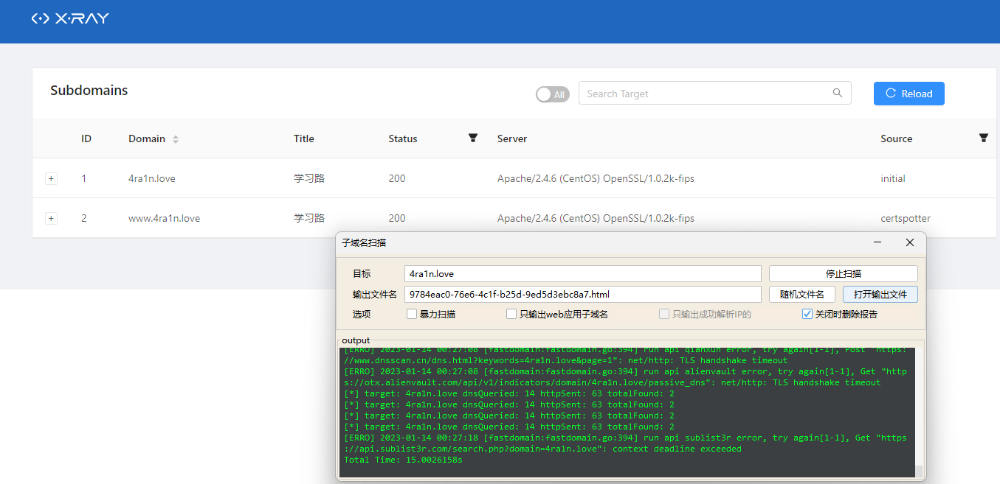
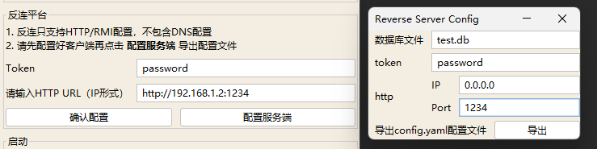

<h1 align="center">Welcome to xray 👋</h1>
<p>
  
  
  
  <a href="https://chaitin.github.io/xray/#/">
    
  </a>
</p>

> A powerful security assessment tool

### ✨ Demo


[**中文版本**](./README.md)

🏠[Document](https://docs.xray.cool)  ⬇️[Download](https://github.com/chaitin/xray/releases) 

Note: xray is not open source, you can download the built binaries directly, and the poc in the repository, which is mainly contributed by the community, will be packaged automatically for each xray release.

## 🚀 Quick use

**Before using the tool, read and agree to the terms especially the disclaimer in the [License](https://github.com/chaitin/xray/blob/master/LICENSE.md). Otherwise, do not install or use the tool.**

1. Use the base basic web crawler scan to scrape and perform vulnerability scanning on the scraped links

    ```bash
    xray webscan --basic-crawler http://example.com --html-output vuln.html
    ```

2. Use an HTTP proxy for passive scanning

    ```bash
    xray webscan --listen 127.0.0.1:7777 --html-output proxy.html
    ```
   Set the browser http proxy to `http://127.0.0.1:7777` to analyze proxy traffic and scan automatically.

   >To scan https traffic, read the `Crawling https Traffic` section below

3. Only a single url is scanned, without crawlers

    ```bash
    xray webscan --url http://example.com/?a=b --html-output single-url.html
    ```

4. Manually configure the plugins to run this time

   By default, all built-in plugins are enabled. You can specify which plugins are enabled for this scan using the following command.

   ```bash
   xray webscan --plugins cmd-injection,sqldet --url http://example.com
   xray webscan --plugins cmd-injection,sqldet --listen 127.0.0.1:7777
   ```

5. Specifying plugin output

   You can choose targeted vulnerability and their details of this scan and export a report:

    ```bash
    xray webscan --url http://example.com/?a=b \
    --text-output result.txt --json-output result.json --html-output report.html
    ```

   [Sample Report](https://docs.xray.cool/assets/report_example.html)

For other uses, read the documentation： https://docs.xray.cool


## 🛠 Detection module

New detection modules will be added continuously

- XSS vulnerability detection (key: xss)

  Semantic analysis is used to detect XSS vulnerabilities


- SQL Injection Detection (key: sqldet)

  It supports error injection, Boolean injection, time blind injection, etc


- Command/Code injection detection (key: cmd-injection)

  It supports shell command injection, PHP code execution, template injection, etc


- dirscan (key: dirscan)

  Detects more than 10 sensitive paths and files, including backup files, temporary files, debug pages, and configuration files


- Path traversal detection (key: path-traversal)

  Support for common platforms and encodings


- XML Entity Injection Detection (key: xxe)

  Support for echo and reverse platform detection


- POC management (key: phantasm)

  Some commonly used POCs are built in by default. Users can build and run POCs based on their needs. Document: https://docs.xray.cool/#/guide/poc


- File upload detection (key: upload)

  Support for common back-end languages


- Weak password detection (key: brute-force)

  The Community Edition supports the detection of HTTP basic authentication and weak passwords for simple forms, with a built-in dictionary of common user names and passwords


- jsonp detection (key: jsonp)

  Detects jsonp interfaces that contain sensitive information that can be read across domains


- ssrf detection (key: ssrf)

  ssrf detection module supports common bypass technology and reverse platform detection


- Baseline detection (key: baseline)

  Detects low SSL versions, missing or incorrectly added http, and so on


- Redirection detection (key: redirect)

  Support HTML meta jump, 30x jump, etc


- CRLF injection (key: crlf-injection)

  Detects HTTP header injection and supports parameters for query, body, etc


- Struts2 series vulnerability detection (Premium edition，key: struts)

  Detect whether the target website has Struts2 series vulnerabilities, including s2-016, s2-032, s2-045 and other common vulnerabilities


- Thinkphp series vulnerability detection (Premium edition，key: thinkphp)

  Detect vulnerabilities in ThinkPHP websites


- ..


## ⚡️ Advanced use

See https://docs.xray.cool/ for the following advanced uses.

- Modifying the configuration file
- Scraping https traffic
- Modifying the http packet sending configuration
- Employing reverse platforms
- ...

## ⚡️ Advanced use

### Download

Latest Download：[Latest Release](https://github.com/4ra1n/super-xray/releases/latest)

### PoC Search

It is easy to search poc and run:


### PoCs

Search and Copy


### With rad

After version 0.8, it can be linked with `rad`:

Note: First enter the port to enable passive scanning, and then open the `rad` coordination


### Download Panel

After version 1.0, we support download panel:


### Subdomain Scan

After version 1.0, we support subdomain scan:



### Reverse

1. Finish client reverse config and Click Configure Server
2. Enter any database file name
3. Enter the token password arbitrarily
4. Do not change the IP address and enter a listening port
5. Click Export Configuration File to get a reverse/config.yaml
6. Copy xray and this file to the server
7. Server `./xray reverse` Start the reverse platform
8. Enter the corresponding token and http url on the reverse connection platform (note that the IP format is http://1.1.1.1:8080 ）
9. Enable active scanning or passive scanning



### Menu

Help


Version Check


## 😘 Contribute POC

See: https://docs.xray.cool/#/guide/contribute

## 📝 Discussion area

Feedback of  false positives,false negatives, please don’t hesitate to contact us. Be sure to read https://docs.xray.cool/#/guide/feedback first

If you have a question, you can ask it on GitHub or in the discussion group below

1. GitHub issue: https://github.com/chaitin/xray/issues
2. Wechat official account: Scan the following QR code on wechat and subscribe us


3. Wechat group: wechat scan the following QR code to add the group


4. QQ group: 717365081
